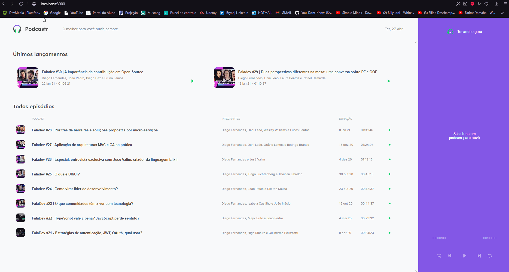

# NLW05-TrilhaReactJS-Rocketseat

<h1 align="center">

  
</h1>

  <a href="#-tecnologias">Tecnologias</a>&nbsp;&nbsp;&nbsp;|&nbsp;&nbsp;&nbsp;
  <a href="#-Objetivo">NLW</a>&nbsp;&nbsp;&nbsp;|&nbsp;&nbsp;&nbsp;
  <a href="#-projeto">Projeto</a>&nbsp;&nbsp;&nbsp;|&nbsp;&nbsp;&nbsp;
  <a href="#-how-to-test">How to test?</a>&nbsp;&nbsp;&nbsp;|&nbsp;&nbsp;&nbsp;

 

  

## 🚀 Tecnologias

Esse projeto foi desenvolvido com as seguintes tecnologias/ferramentas:

- TypeScript
- React
- Next
- Axios
- Sass

## 🔖 NLW - Next Level Week Rocketseat

"Next Level Week (NLW) é uma semana prática com muito código e desafios, onde tem como um único objetivo: levá-lo ao próximo nível.

Através do método da Rocketseat, aprenderemos novas ferramentas, novas tecnologias. Um evento online e totalmente gratuito que o ajudará a dar o próximo passo na sua evolução como desenvolvedor."

## 💻 Projeto da NLW - Trilha React.Js

Foi criado um Podcastr utilizando utilizando uma api falsa com json-server, com o objetivo de adquirir mais conhecimentos sobre React.

## ⚡ How to test?

    --Open terminal--

    #Clone repo TrilhaReactJs from github
    git clone https://github.com/Ryandls/NLW05-TrilhaReactJS-Rocketseat.git

    #Entry in TrilhaNodeJS folder
    cd NLW05-TrilhaReactJS-Rocketseat

    #Run project:

    #Install deps
  
    yarn install

    #Run the development server:

    yarn dev

    #Run False API

    yarn server

    #Page

    http://localhost:3000

<h3><strong>Created by Rocketseat 💜, edited by Bryan.</strong><h3>

